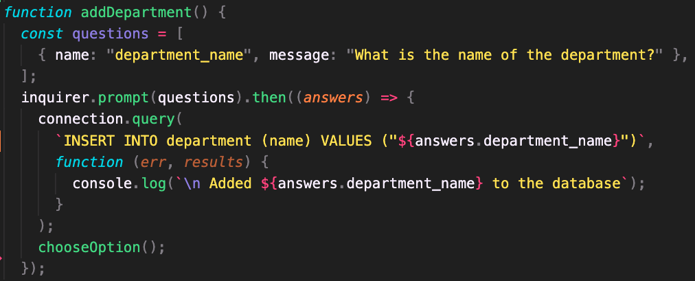

# Employee Tracker

## License

This repo is licensed by MIT

[](https://opensource.org/licenses/MIT)

## Description

Using Node, MySQL, and JavaScript, a user can choose through many options to take some sort of action on a database. User can view information in tables, add to different tables, update a table, etc.

## Table of Contents

- [Installation](#installation)
- [Technologies](#technologies)
- [Demo Link](#demo%20link)
- [Usage](#usage)
- [User Information](#user%20information)
- [Credits](#credits)
- [Tests](#tests)
- [Questions](#questions)

## Installation

To install necessary dependencies, run the following command:

```ruby
npm i
```

## Technologies

- MySQL
- JavaScript
- Node.js

## Demo Link

[Demo Link](https://drive.google.com/file/d/1L3eZtp4oDhspMsJWeaN4CjuJv5U0nXNK/view?usp=sharing)

## Usage

To properly run the program, run:

```ruby
mysql -u root -p
source ./db/schema.sql
source ./db/seeds.sql
```

### Code Snippet



#### Code Snippet of how the department is added to the table in the database.

### Generated Sample HTML


#### Rendered HTML file for the answers from the terminal view above.

## User Information

[Github](https://github.com/smandla) |
[Email](mandla21@up.edu) |
[LinkedIn](https://www.linkedin.com/in/srikavya-mandla/) |
[Portfolio](https://smandla.github.io/kavya_professionalportfolio/)

## Tests

To run tests, run the following command:

```ruby
npm test
```

## Questions

If you have any questions about the repo, open an issue or contact me directly at mandla21@up.edu.

---

© 2022 Trilogy Education Services, LLC, a 2U, Inc. brand. Confidential and Proprietary. All Rights Reserved.
